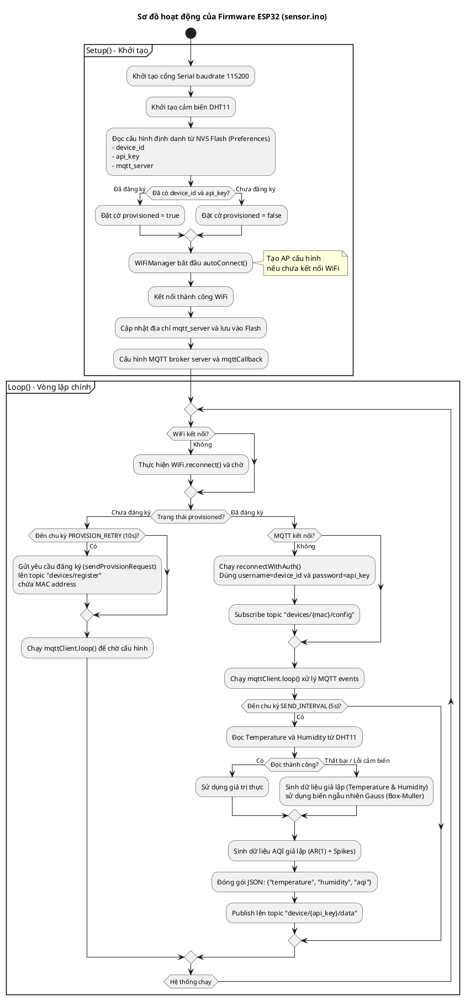
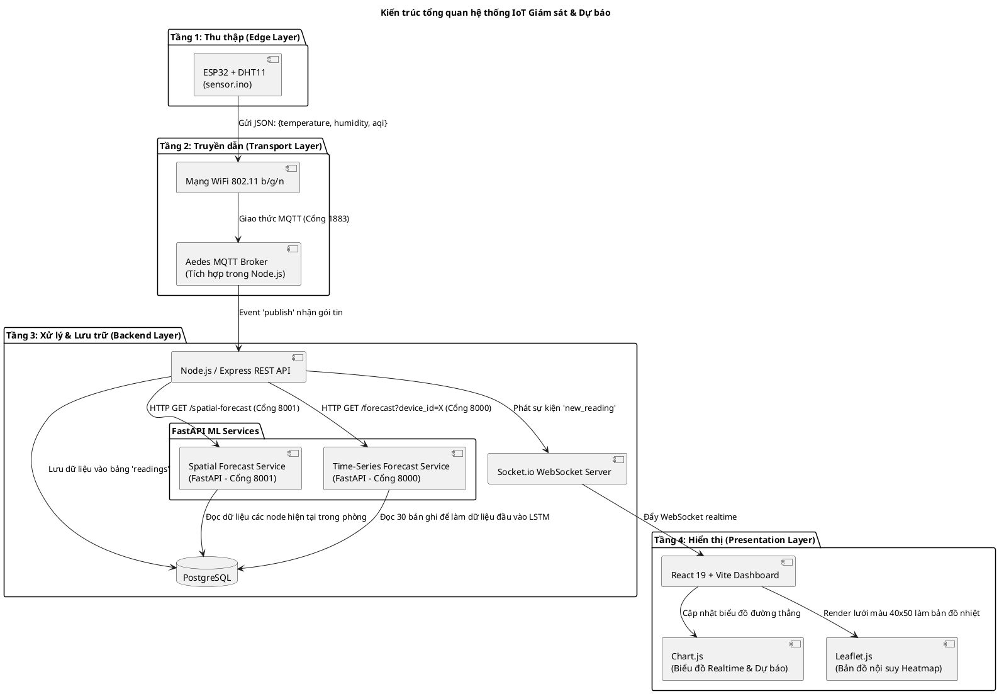
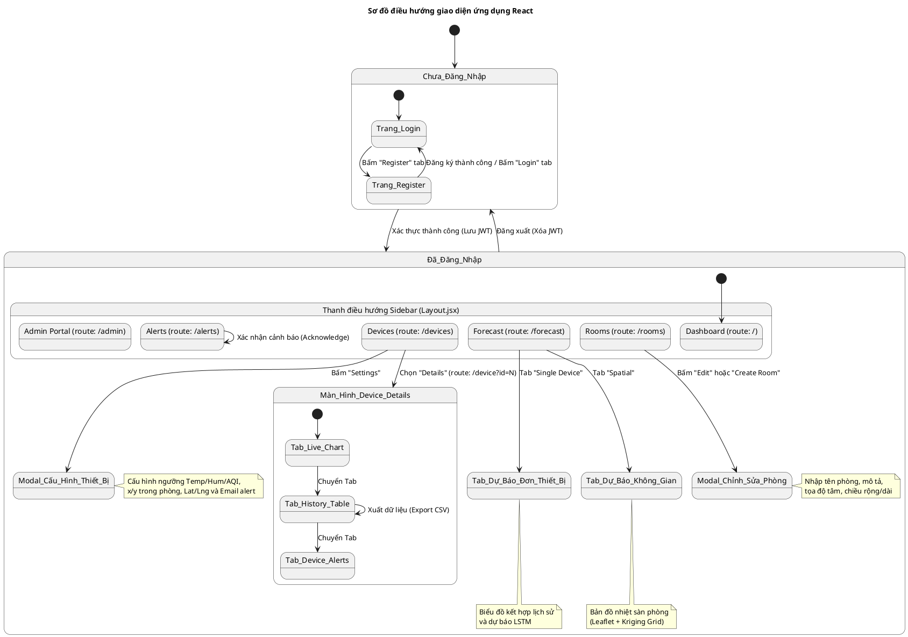
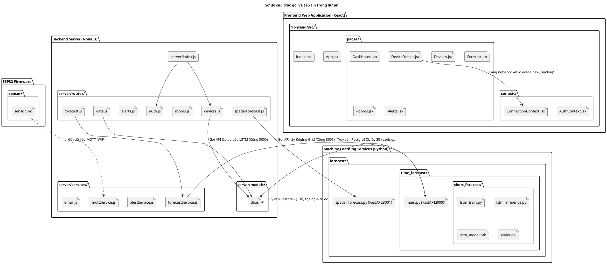
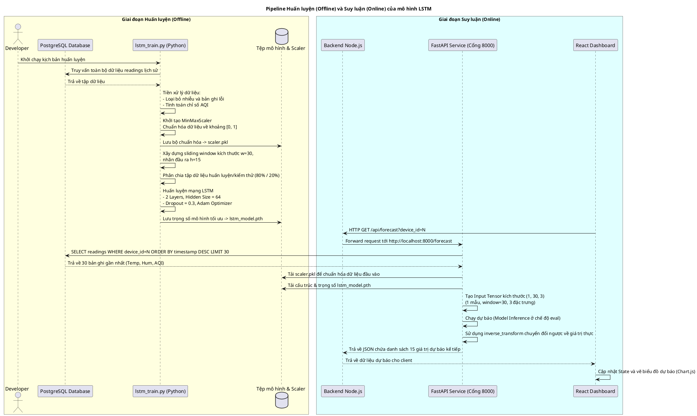

# Mã Nguồn PlantUML Cho Các Sơ Đồ Hệ Thống

Tài liệu này cung cấp mã nguồn PlantUML cập nhật cho 5 sơ đồ (b, c, d, e, f) để bạn có thể sao chép và tự sinh lại các tệp hình ảnh tương ứng. Các sơ đồ này đã được sửa đổi để khớp 100% với mã nguồn thực tế của dự án.

---

## 1. Sơ đồ b: Sơ đồ Hoạt động Firmware ESP32 (`firmware_arch.jpg`)

Sơ đồ này phản ánh vòng lặp logic (chương trình đơn phẳng) thực tế của firmware [sensor.ino](file:///d:/stuff/weather_dashboard/sensor/sensor.ino). Nó không chứa các thành phần Power Manager hay Machine Learning chạy trên bo mạch.

---

## 2. Sơ đồ c: Kiến trúc Tổng quan Hệ thống (`arch_overview.jpg`)

Sơ đồ này làm rõ cấu trúc 4 tầng, luồng đi của payload JSON có trường `aqi` và phân tách rõ 2 dịch vụ FastAPI chạy trên các cổng `:8000` (LSTM) và `:8001` (Kriging).

---

## 3. Sơ đồ d: Sơ đồ Điều hướng Giao diện React (`nav_diagram.jpg`)

Sơ đồ này phản ánh chính xác luồng điều hướng của Single Page Application (React Router) trong file [App.jsx](file:///d:/stuff/weather_dashboard/frontend/src/App.jsx).

---

## 4. Sơ đồ e: Sơ đồ Cấu trúc Gói và Tập tin (`package_diagram.jpg`)

Sơ đồ thể hiện đúng cấu trúc thư mục thực tế của dự án.

---

## 5. Sơ đồ f: Pipeline huấn luyện và dự báo LSTM (`lstm_pipeline.jpg`)

Sơ đồ thể hiện quy trình học máy với thông số cấu hình `dropout=0.3` chuẩn của mô hình.

